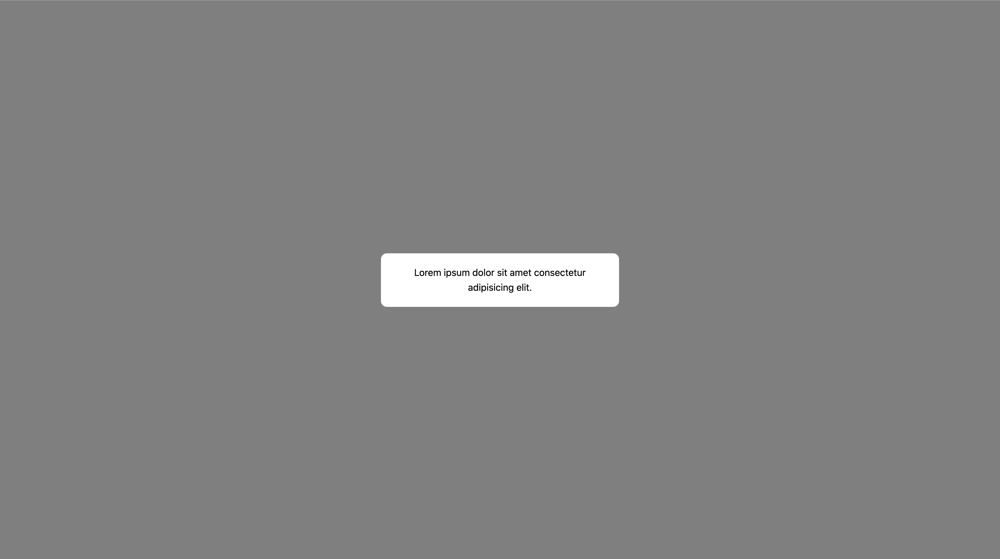

# react-modal-dom


## Lightweight and customizable modal with react

We do not limit you with html markup. You can create responsive modal windows of absolutely any format and manage them from anywhere in your react application.

## Installation
```javascript
npm i react-modal-dom
# or
yarn add react-modal-dom
```

## Demo

Check out the demo here https://react-modal-dom.netlify.app/

## Usage

> Step 1 - add "ModalComponent" into your index.js file. 


```
Note!
Use only one 'ModalComponent' component in the app.
```

```javascript
import React from 'react';
import ReactDOM from 'react-dom';
import ModalComponent from 'react-modal-dom';

import App from './App';

ReactDOM.render(
  <React.StrictMode>
    <ModalComponent />
    <App />
  </React.StrictMode>,
  document.getElementById('root')
);
```

> Step 2 - create your custom modal window

```javascript
const MyModal = () => {
  return (
    <div className='modal'>
      <p>Lorem ipsum dolor sit amet consectetur adipisicing elit.</p>
    </div>
  );
};

export default MyModal;
```

What you will get:


> Step 3 - use css to create styles for your modal

```css
/* example */
.modal {
  width: 100%;
  max-width: 400px;
  padding: 20px;
  border-radius: 10px;
  background: #fff;
}
```
What you will get:


> Step 4 - use `modal` obj methods to close or open your modal window
```javascript
import React from 'react';
import { modal } from 'react-modal-dom';

import MyModal from '../MyModal';

const MyApp = () => {
  const handleOpenModal = () => {
    modal.open(<MyModal/>)
  }
  return (
    <>
      <button type="button" onClick={handleOpenModal}>
        Open modal
      </button>
      <button type="button" onClick={modal.close}>
        Close modal
      </button>
    </>
  );
};

export default MyApp;
```
## `modal` object
This object has only 2 methods: `close` and `open`
```javascript
modal.open(<CustomModal/>, callback)
modal.close(callback)
```

`<CustomModal />` - valid react component. Use only jsx sintaxis   
`callback` - provide callback that will call immediately after your modal close or open


## Use `modal` obj methods even in your redux actions

```javascript
import { modal } from 'react-modal-dom';

export const myAction = () => async dispatch => {
  dispatch({ type: 'START' });
  try {
    // ....
    dispatch({ type: 'SUCCESS', payload: data });
    // close modal here
    modal.close();
  // ....
```

```javascript
import { modal } from 'react-modal-dom';

function* myWatcher() {
  try {
    // ...
    yield put({ type: 'SUCCESS', payload: data });
    // close modal here
    modal.close();
  // ...
}
```

## Create function to open your custom modal in redux files

```javascript
import { modal } from 'react-modal-dom';

const MyModal = () => {
  return (
    <div className='modal'>
      <p>Lorem ipsum dolor sit amet consectetur adipisicing elit.</p>
    </div>
  );
};

export const openMyModal = () => {
  modal.open(<MyModal />)
}

export default MyModal;
```

```javascript
import { openMyModal } from '../MyModal';

export const myAction = () => async dispatch => {
  dispatch({ type: 'START' });
  try {
    // ....
    dispatch({ type: 'SUCCESS', payload: data });
    // open your custom modal
    openMyModal();
  // ....
```

```javascript
import { openMyModal } from '../MyModal';

function* myWatcher() {
  try {
    // ...
    yield put({ type: 'SUCCESS', payload: data });
    // open your custom modal
    openMyModal();
  // ...
}
```